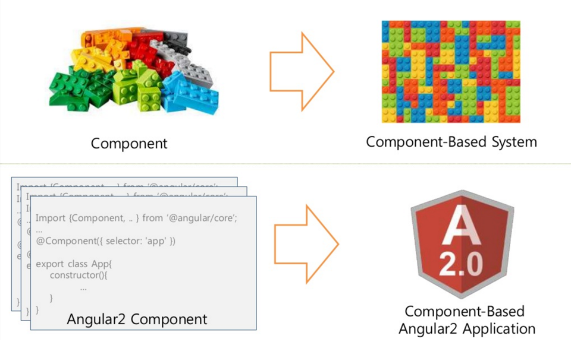
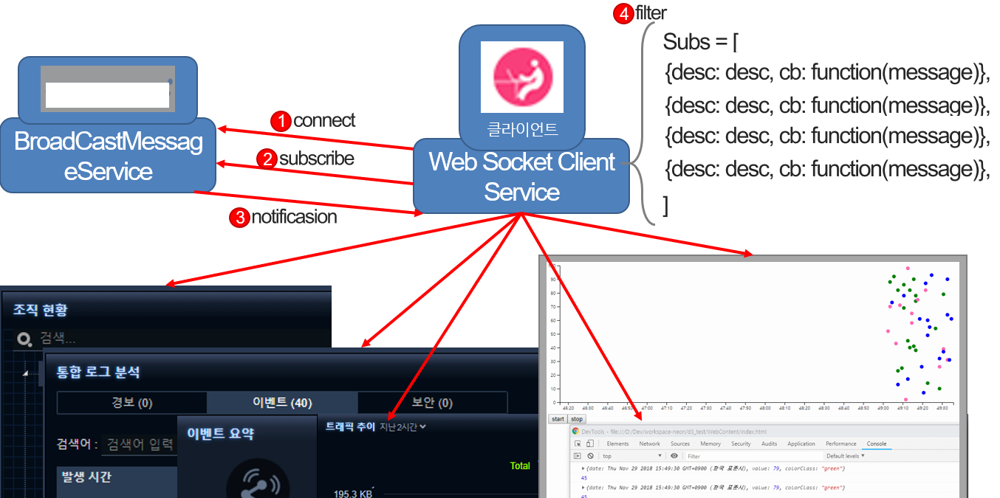
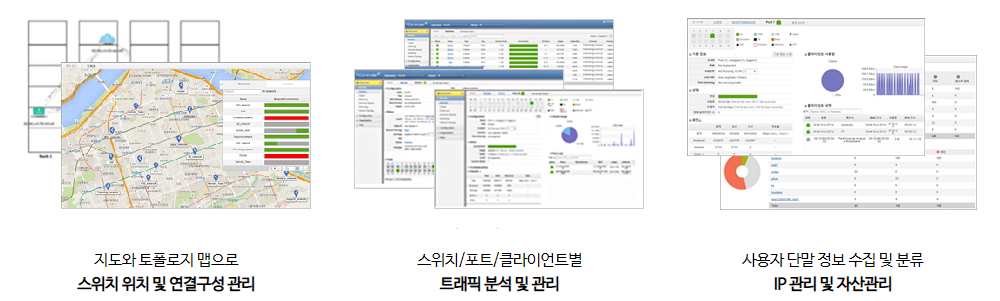
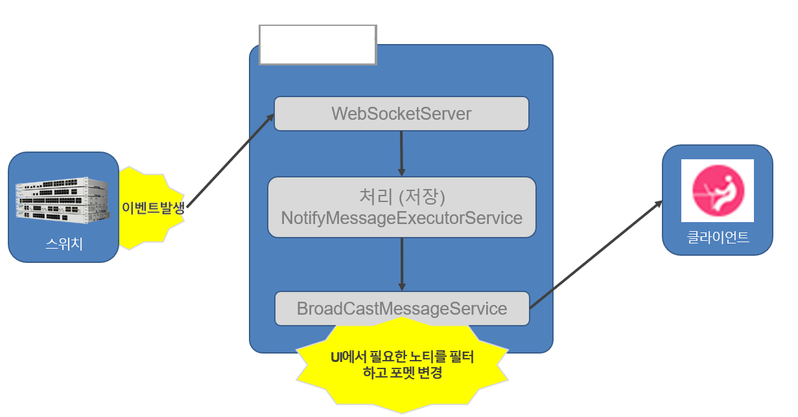
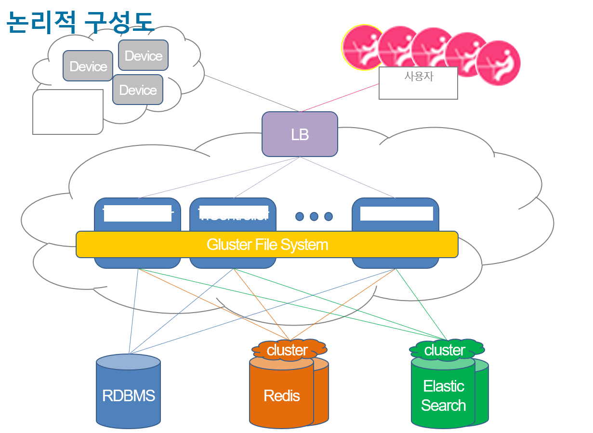
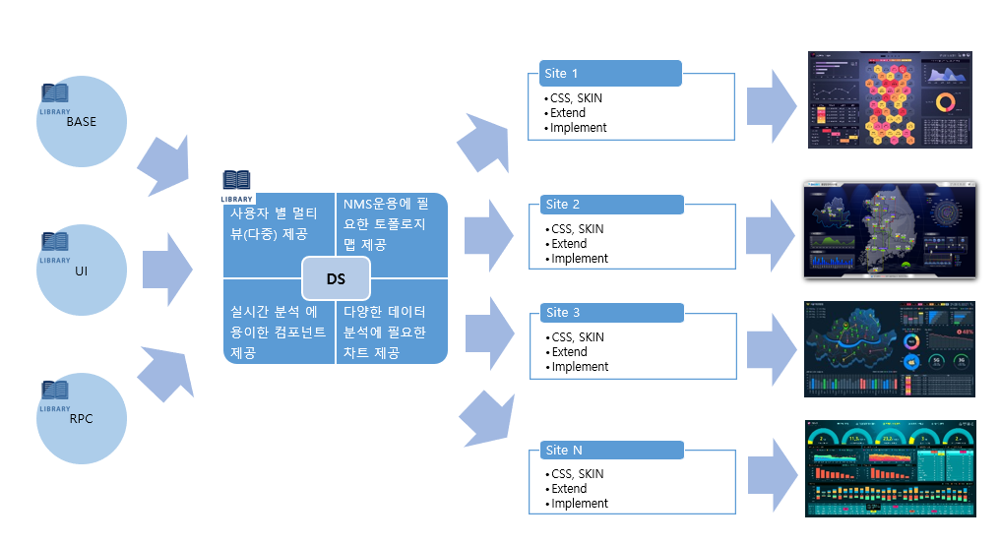
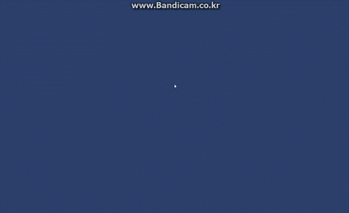

# 프로필

  

    <h2>최 영 화</h2>
    <h3>9년차 풀스택 개발자</h2>
    어쩌구 저쩌구 어쩌구 저쩌구 어쩌구 저쩌구 어쩌구 저쩌구 어쩌구 저쩌구 어쩌구 저쩌구 어쩌구 저쩌구 어쩌구 저쩌구 어쩌구 저쩌구 어쩌구 저쩌구 어쩌구 저쩌구 어쩌구 저쩌구 어쩌구 저쩌구 어쩌구 저쩌구 어쩌구 저쩌구 어쩌구 저쩌구 어쩌구 저쩌구 어쩌구 저쩌구 어쩌구 저쩌구 어쩌구 저쩌구 어쩌구 저쩌구 어쩌구 저쩌구 어쩌구 저쩌구 
  

  

    
    <ul>
      <li>최영화</li>
      <li>1986.02.24</li>
      <li><a href="mailto: nice1st_p@naver.com">nice1st_p@naver.com</a></li>
      <li><a href="https://github.com/nice1st">https://github.com/nice1st</a></li>
    </ul>
  

# 기술

## Back-end

<ul class="skill horizon5">
  <li>JAVA</li>
  <li>Spring</li>
  <li>JPA</li>
  <li>Spring Cloud MSA</li>
  <li>JWT</li>
  <li>Gradle</li>
  <li>RabbitMQ</li>
  <li>NodeJS</li>
  <li>Dotnet</li>
  <li>Mysql</li>
  <li>Redis</li>
</ul>

## Front-end

<ul class="skill horizon5">
  <li>Javascript</li>
  <li>ES6</li>
  <li>Vanilla JS</li>
  <li>React</li>
  <li>Web Component</li>
</ul>

## ETC

<ul class="skill horizon5">
  <li>Git</li>
  <li>SVN</li>
  <li>Jenkins</li>
  <li>Docker</li>
  <li>Linux</li>
  <li>Vi</li>
  <li>Redmine</li>
</ul>

# 경력 (총 9년)

2020.06 ~ 현재 (약 1년)

KTICT  CCTV 웹 뷰어

* 개발환경 구축
  * 시스템 구성: Spring Cloud 기반 MSA 설계 및 개발
  * 데이터 모델링 및 RDB 설계
  * vanilla JS 컴포넌트 기반 개발
  * UI 개발

  <ul class="experience_keyword">
    <li>Dotnet</li>
  </ul>

<!-- ## 띵스파이어
* 2019.10 ~ 2020.05 (6개월)
* GIS 기반 유무선 통신장비 관제 UI 개발

## 파이오링크
* 2016.11 ~ 2019.08 (2년 9개월)
* 조직문화에 대한 고민
  * 기술 및 개발내용 공유를 위해 노력 했습니다.
   
  
   
    * 컴포넌트기반 개발
    * 메시지 pub/sub 모델
    * MSA

## 다임즈
* 2011.07 ~ 2016.04 (4년 9개월)
* 좋은 UI에 대한 고민
  * 최소한의 요청과 직관성

## 네트워크 스위치 컨트롤러
네트워크 스위치 통신하여 상태를 확인하고 설정할 수 있는 웹 어플리케이션
  
  * 메시지 Broadcast 모듈 개발
   
   
    * 장비의 상태 수집 상황 및 장애 정보를 대시보드에서 실시간으로 관제할 수 있도록 메시지 구독 형태의 모듈을 설계 및 개발 했습니다.
  * 레거시 프로젝트 Scale out 분석 및 구성
   
   
  * 대시보드 플랫폼 설계 및 개발
    

## EMS 통합관제
네트워크, 트래픽, 서버, DBMS 등의 장비에서 수집 된 정보를 대시보드로 서비스 하는 웹 어플리케이션
  
* 주로 대시보드 개발
* CRUD UI 및 이력/통계/레포트 개발 -->
