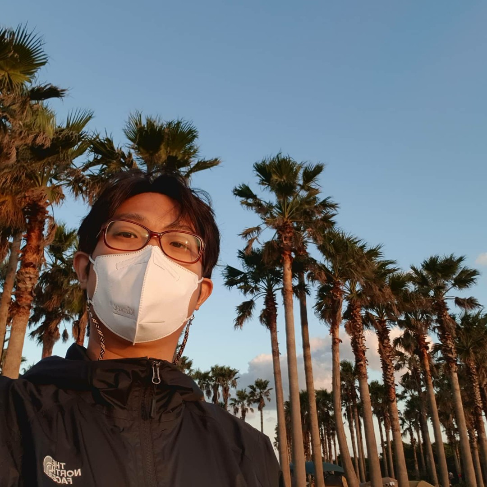
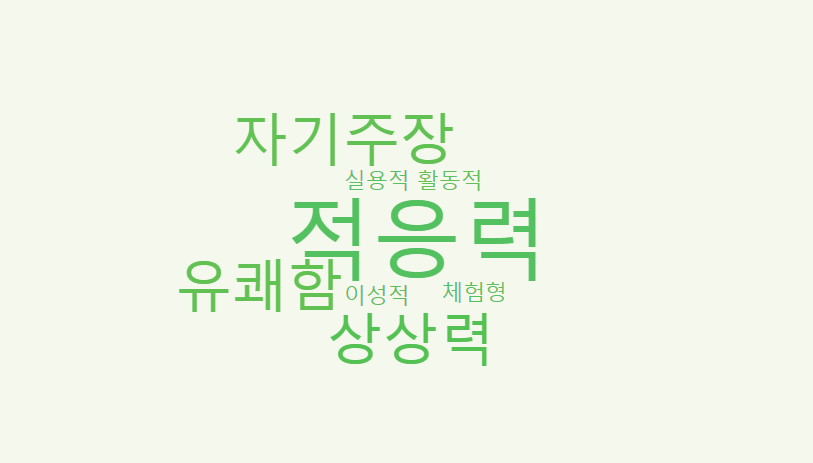

# 프로필

* 최영화
* 1986.02.24
* <nice1st_p@naver.com>
* <https://github.com/nice1st>

# 소개
## 기술

* JAVA
  * Spring framework 환경에서 웹, API, 통신, 수집 서버 개발을 경험 했습니다.
* Javascript
  * ES6 기반 vanilla JS 프레임워크 환경에 관심을 가지고 개발 하고 있습니다.
* MQ, Webflux
  * 최근 비동기 프로그래밍에 관심이 많습니다.

## 관심사

* 서비스플랫폼
  * 소프트웨어 중심의 서비스 플랫폼 개발을 경험 해보고 싶습니다.
* 조직문화와 성장
  * 조직문화가 주는 긍정적인 시너지 효과를 기대합니다.
* 데이터모델링
  * 목적과 대상을 추상화하여 확장성이 용이할 때 큰 성취감을 느낍니다.

## 성격

* 적응력
  * 주변 환경을 잘 돌아보며, 대부분의 조직활동에서 적응을 잘 했습니다.
* 자기주장
  * 생각을 숨기지 않는 편입니다. 오해를 피하기 위해 상대방의 이야기를 끝까지 잘 듣고 이해 한 뒤에  이야기하려 노력합니다.

# 프로젝트
## CCTV 뷰어
기관에서 수집 된 CCTV 영상을 관제하고 활용할 수 있는 웹 어플리케이션
* Back-end
 

  * 시스템 구성: Spring Cloud 기반 MSA 설계 및 개발
  * 데이터 모델링 및 RDB 설계
* Front-end
  * vanilla JS 컴포넌트 기반 개발
  * UI 개발

## 네트워크 스위치 컨트롤러
네트워크 스위치 통신하여 상태를 확인하고 설정할 수 있는 웹 어플리케이션
* Back-end
  * 실시간 대시보드 메시지 전달을 위해 모듈 개발
    * 장비의 상태 수집 상황 및 장애 정보를 대시보드에서 실시간으로 관제할 수 있도록 메시지 구독 형태의 모듈을 설계 및 개발 했습니다.
* Front-end

## SDN
SDN 설정 웹 어플리케이션
* 

## EMS 통합관제
네트워크, 트래픽, 서버, DBMS 등의 장비에서 수집 된 정보를 대시보드로 서비스 하는 웹 어플리케이션

# 경력
## KTICT
* 2020.06 ~ 현재
* 개발환경 구축
 

## 띵스파이어
* 2019.10 ~ 2020.05 (6개월)
* GIS 기반 유무선 통신장비 관제 UI 개발

## 파이오링크
* 2016.11 ~ 2019.08 (2년 9개월)
* 조직문화에 대한 고민
  * 기술 및 개발내용 공유를 주도 했습니다.

## 다임즈
* 2011.07 ~ 2016.04 (4년 9개월)
* 좋은 UI에 대한 고민
  * 최소한의 요청과 직관성
