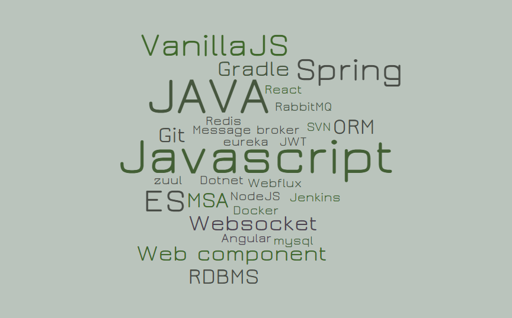
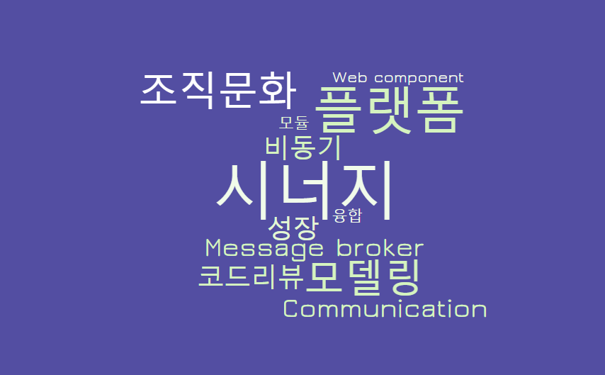
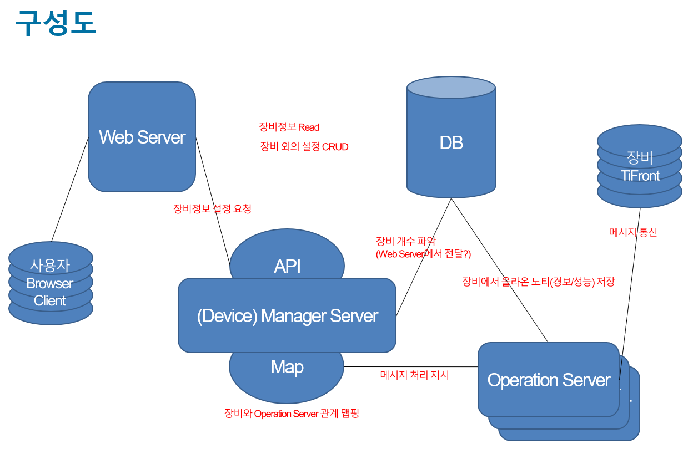

# 프로필

  

  <ul>
    <li>최영화</li>
    <li>1986.02.24</li>
    <li><a href="mailto: nice1st_p@naver.com">nice1st_p@naver.com</a></li>
    <li><a href="https://github.com/nice1st">https://github.com/nice1st</a></li>
  </ul>

# 소개
## 기술

  

  <ul>
    <li>
      JAVA
      <ul>
        <li>Spring framework 환경에서 웹, API, 통신, 수집 서버 개발을 경험 했습니다.</li>
      </ul>
    </li>
    <li>
      Javascript
      <ul>
        <li>ES6 기반 vanilla JS 프레임워크 환경에 관심을 가지고 개발 하고 있습니다.</li>
      </ul>
    </li>
    <li>
      MQ, Webflux
      <ul>
        <li>최근 비동기 프로그래밍에 관심이 많습니다.</li>
      </ul>
    </li>
  </ul>

## 관심사

  

  <ul>
    <li>
      서비스플랫폼
      <ul>
        <li>소프트웨어 중심의 서비스 플랫폼 개발을 경험 해보고 싶습니다.</li>
      </ul>
    </li>
    <li>
      조직문화와 성장
      <ul>
        <li>조직문화가 주는 긍정적인 시너지 효과를 기대합니다.</li>
      </ul>
    </li>
    <li>
      데이터모델링
      <ul>
        <li>목적과 대상을 추상화하여 확장성이 용이할 때 큰 성취감을 느낍니다.</li>
      </ul>
    </li>
  </ul>

## 성격

  

  <ul>
    <li>
      적응력
      <ul>
        <li>주변 환경을 잘 돌아보며, 대부분의 조직활동에서 적응을 잘 했습니다.</li>
      </ul>
    </li>
    <li>
      자기주장
      <ul>
        <li>생각을 숨기지 않는 편입니다. 오해를 피하기 위해 상대방의 이야기를 끝까지 잘 듣고 이해 한 뒤에  이야기하려 노력합니다.</li>
      </ul>
    </li>
  </ul>

# 프로젝트
## CCTV 뷰어
기관에서 수집 된 CCTV 영상을 관제하고 활용할 수 있는 웹 어플리케이션
* Back-end
  
  * 시스템 구성: Spring Cloud 기반 MSA 설계 및 개발
  * 데이터 모델링 및 RDB 설계
* Front-end
  
  * vanilla JS 컴포넌트 기반 개발
  * UI 개발

## 네트워크 스위치 컨트롤러
네트워크 스위치 통신하여 상태를 확인하고 설정할 수 있는 웹 어플리케이션
  
  * 메시지 Broadcast 모듈 개발
   
   
    * 장비의 상태 수집 상황 및 장애 정보를 대시보드에서 실시간으로 관제할 수 있도록 메시지 구독 형태의 모듈을 설계 및 개발 했습니다.
  * 레거시 프로젝트 Scale out 분석 및 구성
   
   
  * 대시보드 플랫폼 설계 및 개발
    

## EMS 통합관제
네트워크, 트래픽, 서버, DBMS 등의 장비에서 수집 된 정보를 대시보드로 서비스 하는 웹 어플리케이션
  
* 주로 대시보드 개발
* CRUD UI 및 이력/통계/레포트 개발

# 경력 (총 9년)
## KTICT
* 2020.06 ~ 현재 (약 1년)
* 개발환경 구축
 
 

## 띵스파이어
* 2019.10 ~ 2020.05 (6개월)
* GIS 기반 유무선 통신장비 관제 UI 개발

## 파이오링크
* 2016.11 ~ 2019.08 (2년 9개월)
* 조직문화에 대한 고민
  * 기술 및 개발내용 공유를 위해 노력 했습니다.
   
  
   
    * 컴포넌트기반 개발
    * 메시지 pub/sub 모델
    * MSA

## 다임즈
* 2011.07 ~ 2016.04 (4년 9개월)
* 좋은 UI에 대한 고민
  * 최소한의 요청과 직관성
